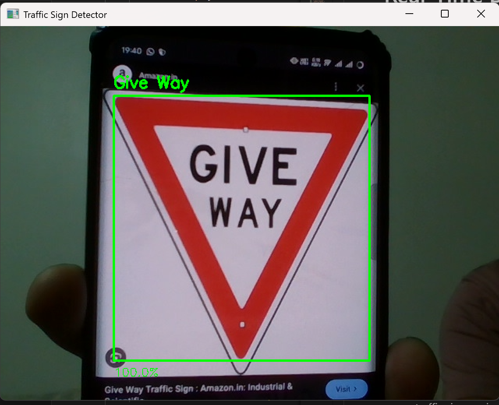

# 🛑 Indian Traffic Sign Classifier & Real-Time Detector

A deep learning application that detects and classifies Indian Traffic Signs in real-time using CNN and OpenCV.

Unlike standard tutorials that use static images, this project implements a detector that automatically locates signs (Red, Blue, or Yellow) from a live webcam feed, crops them, and classifies them with **86% accuracy** using a 64x64 model.


## 📸 Demo


## 🚀 Key Features
* **Universal Detection:** Uses HSV Saturation filtering to detect any vivid traffic sign against dull backgrounds.
* **Robust to Real-World Noise:** Uses data augmentation (Zoom, Shear, Rotation) during training to handle tilted/shaky webcam footage.
* **Auto-Zoom & Crop:** Dynamically tracks the sign, crops it, and resizes it to ensure the neural network always receives a clean input.


## 🛠️ Challenges & Fixes
Building this wasn't just about `model.fit()`.

### 1. The "Pixel Blob" Problem (32p vs 64p)
* **The Problem:** Initially, the model was trained on 32x32 pixel images. It consistently confused "No Parking" (Class 21) with "No Left Turn" (Class 15).
* **The Root Cause:** At 32x32 resolution, the black symbol for "P" and a "Left Arrow" looked like identical pixel blobs.
* **The Solution:** Refactored the entire pipeline (Training & Detection) to support **64x64 resolution**. This 4x increase in pixel density allowed the CNN to see the curve of the "P", solving the confusion.

### 2. The "Manual Aiming" Struggle
* **The Problem:** The first version required the user to hold the sign inside a static "Blue Box." It was frustrating and prone to background noise errors.
* **The Solution:** I built a **Universal Colour Detector** using HSV thresholds. Instead of looking for "Red", it scans the frame for "High Saturation" objects. This automatically locks onto Red (Stop), Blue (Parking), and Yellow (Warning) signs without manual aiming.


## 🧠 Tech Stack
* **Language:** Python 3.11+
* **Deep Learning:** TensorFlow / Keras (CNN Architecture)
* **Computer Vision:** OpenCV (colour filtering, Contour detection, Perspective warping)
* **Data Processing:** NumPy, Pandas, Scikit-Learn

## 📚 Dataset & Setup

1. **Download the Data:**
   * Get the [Indian Traffic Sign Dataset from Kaggle](https://www.kaggle.com/datasets/neelpratiksha/indian-traffic-sign-dataset).
   * Extract the zip file.
   * Should be ready to use. If not, rename the extracted folder to `Images`.
   
## 🧠 Model Download
The trained model is too large for GitHub. 
[Click here to download traffic_model.keras](https://drive.google.com/file/d/1tr4qz8U0ylaebpthQn4R7q6YE2RJzZwe/view?usp=sharing)

**Setup:** Download this file and place it in the main project folder.


## 📂 Project Structure
```text
/Traffic_Sign_Classifier
├── check_sign.py                  # Dataset check script
├── traffic_model.keras            # The Trained AI Brain
├── realtime_detector.py           # MAIN APP: The Universal Detector
├── train_signs.py                 # The Training Script
├── Images/                        # Dataset
    ├── 0/
    ├── 1/
    ├── 2/
    └──...                    
└── README.md                      # You are here
```

## ⚙️ How to Run

1.  **Install Dependencies:**
    ```bash
    pip install tensorflow opencv-python numpy matplotlib scikit-learn
    ```

2. **(Optional) Check if dataset is loaded:**
    ```bash
    python check_sign.py
    ```
3.  **Run the Detector:**
    ```bash
    python realtime_detector.py
    ```
    *Controls:* Point your webcam at a traffic sign. Press `ESC` to quit.

4.  **(Optional) Re-Train the Model:**
    If you want to improve the brain with new data:
    ```bash
    python train_signs.py
    ```

## 📊 Model Architecture
The custom CNN consists of:
1.  **Input Layer:** 64x64x3 (RGB)
2.  **Conv Block 1:** 60 filters (5x5) + MaxPooling + BatchNormalization
3.  **Conv Block 2:** 30 filters (3x3) + MaxPooling + BatchNormalization + Dropout (0.5)
4.  **Fully Connected:** 500 Neurons
5.  **Output:** Softmax Layer (59 Classes)


